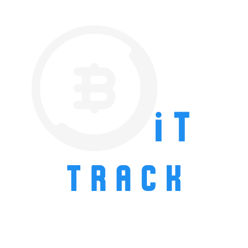
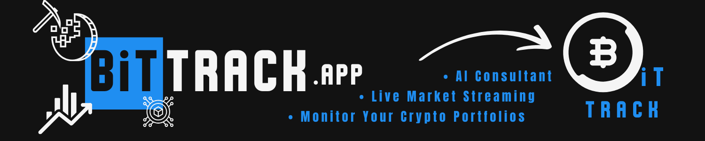

# BitTrack

<p align="left">
  
</p>

## Table of Contents
- [Overview](#overview)
- [Design](#design)
- [Development and Technologies](#development-and-technologies)
- [Deployment](#deployment)
- [What's Next](#whats-next)
- [Developed By](#developed-by)

## Overview
**BitTrack** is a web application for managing and monitoring cryptocurrency portfolios. Users can:
- Add and manage a range of crypto assets.
- View real-time prices for each cryptocurrency.
- Track the total portfolio value, with updates based on live data from a crypto API.
- Receive live investment suggestions from an AI consultant tailored to their holdings.

Built with **Vue3** and styled with **Quasar** for responsive material design, BitTrack uses **Supabase** for user authentication, portfolio database management, and password reset functionality.

## Design

### Pages
The project is crafted for a seamless user experience across devices. The main pages are:

1. **Login/Signup/Reset Password**: Register or log in with Supabase authentication, with a reset password option.
2. **Portfolio Page**: The central hub, displaying:
   - Added assets with options to add, edit, or delete holdings.
   - Real-time cryptocurrency prices, continuously updated.
   - Total portfolio value, dynamically calculated.
   - AI-powered investment suggestions based on asset allocation.
3. **Market Page**: Live market data overview, including prices and trends across a range of cryptocurrencies.
4. **AI Consultant Page**: ~~Dedicated to providing live, personalised investment suggestions. Based on the user’s portfolio and market conditions, the AI consultant offers real-time insights and recommendations to support informed investment decisions.~~ <br/>
   `⚠️ This feature is upcoming.`
5. **Responsive Layout**: Optimised for desktop and mobile devices using Quasar’s responsive components.

### Database Tables
The database for **BitTrack** is structured with the following tables to support portfolio management, cryptocurrency tracking, and personalised investment suggestions:

| Table         | Column       | Data Type    | Description                                                                                             |
|---------------|--------------|--------------|---------------------------------------------------------------------------------------------------------|
| **User**      | `id`         | `uuid`       | Unique identifier for each user, referenced by other tables.                                            |
|               | `email`      | `text`       | User's email address, used for authentication.                                                          |
|               | `password`   | `text`       | User's password, used for authentication (should be securely hashed and managed).                       |
| **Portfolio** | `id`         | `uuid`       | Unique identifier for each portfolio entry.                                                             |
|               | `user_id`    | `uuid`       | References the user’s ID from `User.id`, linking each portfolio entry to a specific user.               |
|               | `crypto_id`  | `uuid`       | References the cryptocurrency ID from the `Crypto` table.                                               |
|               | `quantity`   | `float8`     | The amount of cryptocurrency held by the user.                                                          |
| **Crypto**    | `id`         | `uuid`       | Unique identifier for each cryptocurrency.                                                              |
|               | `name`       | `text`       | The name of the cryptocurrency.                                                                         |
| **Suggestion**| `id`         | `uuid`       | Unique identifier for each suggestion entry.                                                            |
|               | `created_at` | `timestamptz`| Timestamp of when the suggestion was created.                                                           |
|               | `user_id`    | `uuid`       | References the user’s ID from `User.id`, linking each suggestion to a specific user.                    |
|               | `content`    | `text`       | The investment suggestion text tailored to the user’s portfolio.                                        |

This schema supports user-specific data by linking the `Portfolio` and `Suggestion` tables to `User.id`. It ensures that each user’s portfolio and suggestions are securely separated and managed.

## Development and Technologies
This project leverages the following technologies:

- **[Vue3](https://vuejs.org/)**: Front-end framework with a reactive component structure.
- **[Quasar](https://quasar.dev/)**: UI library with responsive, material design components.
- **[Supabase](https://supabase.com/)**: Manages user authentication, enables a secure password reset feature, and offers a real-time database for storing portfolios and AI recommendation history.
- **[CoinGecko API](https://www.coingecko.com/)**: Live cryptocurrency prices for accurate portfolio valuation.
- **GPT AI**: AI assistant providing real-time investment insights based on current holdings.

The code is modular, with encapsulated API calls and Supabase functions to maintain clarity and reusability.

## Deployment
- The app is deployed on **[Vercel](https://vercel.com/)**. 
- Visit the website: [BitTrack](https://bit-track.vercel.app/#/signup). <br/>
`If you have any issues with login, signup, or other account-related matters, please don't hesitate to contact me!`

### Local Setup
1. Clone the repository.
2. Run `npm install` to install dependencies.
3. Add an `.env` file with the following content:
   ```.env
   VITE_SUPABASE_URL={Supabase Project URL}
   VITE_SUPABASE_KEY={Supabase's Project Key}
   VUE_APP_BASE_URL={http://localhost:9000}
4. Run `npm run dev` to start the development server locally.

## What's Next
Future improvements planned for BitTrack include:

- **Code Refactoring**: Streamlining code for better readability and performance.
- **Enhanced Error Handling**: Introducing robust error management to improve stability.
- **AI Consultant Integration**: Connecting the AI Consultant with an existing AI model for more personalised recommendations.
- **UI/UX Refinements**: Further enhancing the user interface and experience based on user feedback.

## Developed by
- The application is developed by _[is0xJim](https://linktr.ee/is0xjh25)_.
- Special gratitude goes to [CoinGecko](https://www.coingecko.com/) for providing an API that enhances the application's functionality.

<p align="left">
  
</p>
